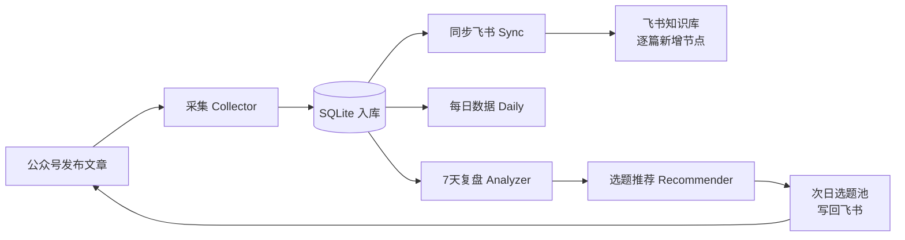

# kb_autosync · 公众号 × 飞书 自增长知识库系统

> 一套让微信公众号内容**自动沉淀进飞书知识库、并随发布不断自我成长**的自动化系统。
> 发布文章 → 自动同步飞书 → 每日抓数据 → 7 天复盘 → 每晚 22:00 自动出次日选题。

---

## 这是什么 / 谁适合用

如果你运营一个微信公众号，并且想把每篇文章自动归档到飞书知识库、还能基于历史数据和全网热点**自动获得"明天发什么"的建议**——这个项目就是为你准备的。

- ✅ 运营者：想要一个会自己变厚、自己出选题建议的知识库
- ✅ 团队：把公众号内容沉淀为可检索的团队知识库
- ✅ 开发者：可作为"内容自动化"的脚手架二次开发

**不需要**任何云端服务、不需要服务器常驻（可选）。纯 Python，依赖极少。

---

## 核心闭环（自增长）



知识库每发一篇多一篇；数据每天变厚；每晚的选题越推越懂你的读者。**这就是"会成长"的含义。**

---

## 功能对照

| 你的需求 | 实现位置 |
|---|---|
| ① Skill 发布后自动同步飞书 | `sync` 模块 + `sync.trigger_categories: ["Skill"]`（可改/可全量） |
| ② 早晚 + 22:00 抓数据 / 梳理 / 7 天复盘 | `scheduler` 编排：`morning`(08:00) / `evening`(20:00) / `night`(22:00) |
| ③ 22:00 选题推荐 | `recommender`：历史表现权重 × 平台热点（微博/头条/百度，按领域关键词过滤） |

---

## 快速开始（5 分钟）

### 1. 前置
- Python 3.10+
- 一个**飞书企业自建应用**（用来写知识库）
- 一个微信公众号（用来采集文章；没有也能用 `demo` 模式先看效果）

### 2. 安装（一键）

**Windows（PowerShell）：**
```powershell
powershell -ExecutionPolicy Bypass -File init.ps1
```
**macOS / Linux：**
```bash
bash init.sh
```
脚本会：建虚拟环境 → 装依赖 → 从 `config.example.json` 生成 `config.json` → 跑 `demo` 验证。

> 手动党：`python -m venv .venv && .venv/*/pip install -e .`

### 3. 配置飞书（关键）

1. 打开 [飞书开放平台](https://open.feishu.cn/) → 创建**企业自建应用**。
2. 开通权限：`wiki:wiki`（知识库只读/读写）、`wiki:node:create`（创建节点）、`docx:document`（文档编辑）。
3. 把应用**加入你的知识空间**（在空间设置里添加成员，这一步独立于 API 权限，最容易忘）。
4. 发布应用版本。
5. 打开知识库，复制 URL 里的节点 token：`https://my.feishu.cn/wiki/<这就是token>?...`
6. 把 `app_id` / `app_secret` / `space_id` 填进 `config.json` 的 `feishu` 段（或写进 `.env`）。

### 4. 配置微信（可选，用于真实采集）

- `collector.mode` 支持三种：
  - `url_feed`：把文章 URL 列表放到 `data/source_urls.json`，适合没有 API 权限时手动/半自动
  - `mp_api`：填 `account.appid` / `account.secret`，走公众号素材/数据 API（需已认证服务号）
  - `local_folder`：直接读本地 markdown 文件夹
  - `demo`：内置样例数据，零配置看全效果（默认就用它验证）

### 5. 看效果

```bash
# 离线跑通整条流水线（生成样例数据 → 同步预览 → 7天复盘 → 选题）
kb_autosync demo

# 真实同步飞书（确认配置无误后，去掉 --no-dry-run 才真推）
kb_autosync sync --all --no-dry-run
```

---

## 配置说明（config.json）

| 字段 | 说明 |
|---|---|
| `account` | 公众号名称 / appid / secret（mp_api 模式用） |
| `collector.mode` | `demo` / `url_feed` / `mp_api` / `local_folder` |
| `sync.enabled` | 是否同步飞书 |
| `sync.trigger_categories` | 只同步这些分类；`[]` 表示全量同步 |
| `sync.dry_run` | **默认 true（只预览）**，确认无误设 false 才真推 |
| `feishu.app_id` / `app_secret` | 飞书自建应用凭证 |
| `feishu.space_id` | 知识库 URL 里的节点 token |
| `feishu.parent_node_token` | 可选，指定归档父目录；留空自动用空间根 |
| `feishu.categories` | `{分类名: 节点token}`，命中则归档到对应目录 |
| `feishu.default_category` | 未命中分类时的默认归档名 |
| `recommender.domain_keywords` | 选题过滤用的领域关键词 |
| `recommender.hotspot_sources` | 热点来源平台 |
| `schedule.morning/evening/night` | 三个定时任务的触发时间 |

---

## 命令参考

| 命令 | 作用 |
|---|---|
| `kb_autosync demo` | 离线跑通整条流水线（样例数据） |
| `kb_autosync collect --mode demo` | 采集文章 |
| `kb_autosync sync --all [--no-dry-run]` | 同步到飞书（默认预览，加参数真推） |
| `kb_autosync analyze [--days 7] [--daily]` | 数据梳理 / 7 天复盘 |
| `kb_autosync recommend [--top-n 5] [--no-kb]` | 生成次日选题 |
| `kb_autosync run --job morning\|evening\|night` | 执行单个定时任务 |
| `kb_autosync scheduler` | 常驻定时循环（自带调度器，Ctrl+C 退出） |
| `kb_autosync watch [--interval 15]` | 轮询模式，命中新文章立即同步 |
| `kb_autosync status` | 数据库概览 |

---

## 调度部署（三选一）

### A. WorkBuddy 用户（最省事）
在工作区建 3 个自动化，分别触发：
```
python -m kb_autosync.cli run --job morning --no-dry-run   # 08:00
python -m kb_autosync.cli run --job evening --no-dry-run   # 20:00
python -m kb_autosync.cli run --job night   --no-dry-run   # 22:00
```

### B. cron（Linux/macOS）
```cron
0 8   * * *  cd /path/to/kb_autosync && .venv/bin/python -m kb_autosync.cli run --job morning --no-dry-run
0 20  * * *  cd /path/to/kb_autosync && .venv/bin/python -m kb_autosync.cli run --job evening --no-dry-run
0 22  * * *  cd /path/to/kb_autosync && .venv/bin/python -m kb_autosync.cli run --job night   --no-dry-run
```

### C. systemd（服务器常驻）
用 `kb_autosync scheduler` 作常驻服务，或把上面的 cron 换成 `run --job` 的一次性 service。
自带 `scheduler` 命令本身就是一个纯 Python 定时循环，本地直接跑也能用。

---

## 它为什么"会成长"

1. **知识库自增长**：每发一篇，飞书多一个节点；分类命中则自动归档到对应目录。
2. **数据滚雪球**：每次采集都把阅读/点赞/评论写进 SQLite，越积越厚。
3. **选题越推越准**：`recommender` 用你自己的历史表现（阅读/互动/分类）做权重，叠加全网热点，日复一日，建议越来越贴合你的读者。

---

## 目录结构

```
kb_autosync/
├── config.example.json     # 配置模板（复制为 config.json 后填写）
├── .env.example            # 环境变量模板（凭证可走这里）
├── pyproject.toml          # 打包 / 控制台入口 kb_autosync
├── init.ps1 / init.sh      # 一键初始化
├── kb_autosync/
│   ├── cli.py              # 命令行入口
│   ├── config.py           # 配置加载
│   ├── db.py               # SQLite 数据层
│   ├── collector.py        # 文章采集
│   ├── hotspots.py         # 多平台热点抓取
│   ├── sync.py             # 飞书同步编排
│   ├── feishu/             # 自包含飞书 API（无外部依赖）
│   ├── analyzer.py         # 每日/7天数据分析
│   ├── recommender.py      # 选题推荐
│   └── scheduler.py        # 定时任务编排
└── README.md
```

---

## 故障排查

| 现象 | 原因 / 解决 |
|---|---|
| 同步只预览不推送 | `sync.dry_run` 为 true，或没加 `--no-dry-run` |
| `无法解析知识空间` | `space_id` 填错（要用 wiki URL 的节点 token，不是数字 space_id）；或应用未加入知识空间 |
| `权限不足 (99991672)` | 飞书应用未开通 `wiki` / `docx` 权限或版本未发布 |
| 采集为空 | `collector.mode` 与配置不匹配；微信连接器未连通时先用 `demo` |
| 飞书推送偶发失败 | 已自动进待重试队列（`data/.cache/feishu_pending.json`），修复配置后重跑 `sync` 即可 |

---

## License

[MIT](LICENSE) — 随便用、随便改、随便再分发。
